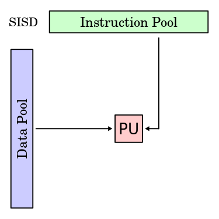
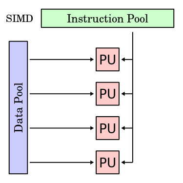
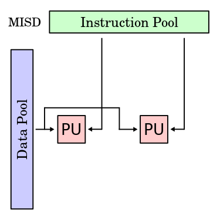
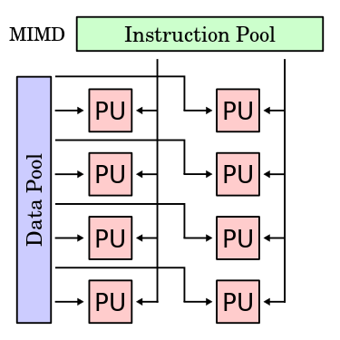

###Assignment One
*Presented By*

**Govind Sharma**

---

####Parallel Computing
**Parallel Computing** is a type of computation in which many calculations or the execution of processes are carried out simultaneosly.

Large problems can often be divided into smaller ones, which can then be solved at the same time.

---

####Distributed Computing
**Distributed Computing** is a field of computing science that studies distributed systems.

A distributed system is a model in which components located on networked computers communincate and coordinate their actions by passing messages. The components interact with each other in order to achieve a common goal.

---

####Parallel vs Distributed
* In parallel computing, all the different processors have the access to a shared memory.
* In distributed computing, all the different processirs have their own private non-shareable memory.
* In a sense, parallel computing is a subset of distributed computing that allows for memory to be shared while multiple processors work simultaneously.

---

####Cloud Computing
The practice of using a network of remote serves hosted on the Internet to store, manage, and process data, rather than a local server or a personal computer.

----

* Provides services over the network.
* Users submit requests and gets the result simultaneosly, hence getting a single system view.
* It is a centralized model controlled by some master server.
* It is often owned by one company and is used to offer services to the users.
* Examples: AWS, Gmail, Facebook, etc.

---

####Grid Computing
At its most basic level, grid computing is a computer network in which each computer''s resources are shared with every other computer in the system. Processing power, memory and data storage are all community resources that authorized users can tap into and leverage for specific tasks.

----

* Machines are spread geographically, connected together to crunch away at big problems.
* It is a decentralized model.
* Often multiple companies collaborate in order to aggregate the computing power.
* The machines are loosely coupled hence the user does not get a single system view.
* Examples: SETI (Search for Extra Terrestial Intelligence)

---

####Cluster Computing
A computer cluster consists of a set of tightly connected computers that work together so that, in many respects, they can be viewed as a single system. Unlike grid computers, computer clusters have each node set to perfor the same task, controlled ans scheduled by software.

----

* Machines are connected locally and coordinated via some protocol governed by a software running from a master node.
* The network is tightly coupled.
* Centralized.
* Single system image to the user.
* Examples: Hadoop and other big data solutions.

---

####Flynn's Texonomy

Flynn's taxonomy is a classification of **computer architectures**, proposed by **Michael J. Flynn** in 1996.

The classification system is used to design modern processors and their functionalities.

----

#####Classifications
The four classifications defined by Flynn are based upon the number of concurrent instruction (or control) streams and data streams available in the architecture.

1. Single instruction stream, single data stream (SISD)
2. Single instruction stream, multiple data stream (SIMD)
3. Single instruction, multiple threads (SIMT)
4. Multiple instructions streams, single data stream (MISD)
5. Multiple instructions streams, multiple data streams (MIMD)

----

####SISD
A sequential computer which exploits no parallelism in either the instruction or data streams. Single control unit (CU) fetches single instruction stream (IS) from memory. The CU then generates appropriate control signals to direct single processing element (PE) to operate on single data steam (DS) i.e., one operation at a time.  

----

####SIMD
A computer which exploits multiple data streams against a single instruction stream to perform operations which may be naturally parallelized. For example, an array processor or graphics processing unit (GPU).  

----

####SIMT
Single instruction, multiple threads (SIMT) is an execution model used in parallel computing where single instruction, multiple data (SIMD) is combined with multithreading.

----

####MISD
Multiple instructions operate on one data stream. Uncommon architecture which is generally used for fault tolerance. Heterogeneous systems operate on the same data stream and must agree on the result. Examples include the Space Shuttle flight control computer.  

----

####MIMD
Multiple autonomous processors simultaneously executing different instructions on different data. MIMD architectures include multi-core superscalar processors, and distributed systems, using either one shared memory space or a distributed memory space.  

---

#####Why the hunger for huge computational prowess?
1. More sources for data generation.
2. Advancement in technology paving way for advanced computational ambitions.
3. Social Network has created data of such variety and volume that mining it can predict things miraculously.
4. Businesses are moving online and are reliable on social trends.
5. Computers are being used to crunch away at problems varrying from medicine, intelligence to even the cosmos.

---

#THANK YOU.
